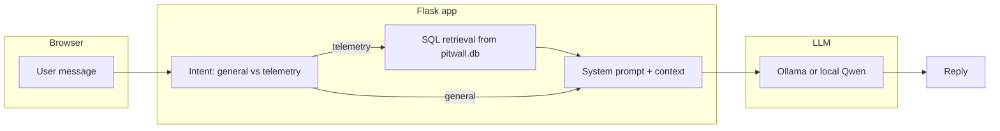

# PitWall

**The pit wall. The radio. The late-night debrief. — except it fits in a browser tab.**

PitWall is a **Flask** web app that plays **AI race engineer**: you chat in natural language about **strategy**, **tyres**, **pace**, and **driving trade-offs**, and—when the data is there—it backs answers with **real lap and sector numbers** pulled from a **local telemetry database** built from **Formula 1 timing data (2022–2025)**.

No smoke machines. No grid girls. Just **FastF1**, **SQLite**, and an LLM that is told very firmly not to invent lap times when the stopwatch is on the table.

---

## The idea (pit lane, plain English)

In a real team, the **pit wall** never guesses sector times from vibes. They have **timings**, **tyre life**, and **long-run curves**. Large language models are brilliant at *sounding* like James Hunt after three espressos, but they will happily hallucinate a 1:28.4 if you let them.

PitWall’s pitch is simple:

1. **Ingest the real world** — Pull official F1 session data (qualifying and races) with **[FastF1](https://github.com/theOehrly/FastF1)**, clean it, and store it in a structured **SQLite** database (`pitwall.db`): laps, sectors, tyres, and resampled on-track telemetry where we need it.
2. **Ask like a human** — A **web chat** lets you type “compare Verstappen and Leclerc in Silverstone Q” instead of writing SQL in a parking garage at 2 a.m.
3. **Answer like an engineer (when the data allows)** — The app **detects** whether you want **general strategy** talk or a **telemetry-grounded** answer. For telemetry, it **queries the database** and only then lets the model speak—so the model is **nudging narrative around numbers that actually exist in your DB**, not inventing a new world record for Sector 2.

The optional **training** side of the repo (LoRA on **Qwen 2.5 3B**, JSONL datasets, eval scripts) is for people who want to **fine-tune** that “engineer voice” on PitWall’s own data conventions. You can run the **UI + Ollama** without touching any of that. See [`setup.md`](setup.md) for the full menu.

---

## What PitWall actually does (feature list)

| Lane | You get |
|------|--------|
| **Chat UI** | A styled **PitWall · Race Engineer Edition** single-page app: conversation, circuit visuals, and a “we’re on air” feel—strategy, telemetry, tyres, and driver mechanics. |
| **Two “modes” of brain** | **General** questions → model + system prompt (F1 2022–25 era knowledge). **Telemetry** questions → **SQL-backed** blocks (laps, gaps, sectors) fed into the model so it must **quote the numbers** when they’re in the prompt. |
| **Real data, real seasons** | Pipeline targets **2022–2025** (post–budget-cap era for cleaner consistency). **Qualifying** and **Race** sessions; qualifying lap/sector data without bloating the cache; race laps plus **throttle, brake, gear, speed** on a resampled distance axis when extracted. |
| **On-demand catch-up** | If a session is missing from the DB, the app can try to **ingest** it via FastF1 when you first ask (network + pipeline permitting). |
| **Inference you control** | Default **Ollama** (e.g. `llama3.2:3b`). Optional **local Qwen 2.5 + PEFT adapter** for fully offline Transformers inference—see `setup.md` §5.2. |
| **Quality guardrails** | Validation and prompts that **discourage** sector-sign mix-ups and empty hand-waving when a lap table is present. |
| **Training / eval (opt-in)** | Scripts to build datasets from computed stats, fine-tune, and evaluate—**not** required to `python app/app.py` and click around. |

---

## How a question becomes an answer (the boring-but-important bit)



- **General mode** — Strategy, “what is understeer,” calendar trivia: the model runs with a **race-engineer** system prompt, no lap query.
- **Telemetry mode** — Your text is parsed into **circuit / year / session** (and friends); the app **fetches** structured rows from **SQLite** (built by the extraction pipeline). That block is appended to the prompt so the model’s job is to **interpret**, not to **fabricate** times.

If **`pitwall.db`** is empty or the session is not there, you’ll get honest **“no data”** behaviour or stubs—not a fantasy quali lap.

---

## What lives in this repo

```
PITWALL/
├── setup.md                 # Step-by-step setup (teammates, venv, Ollama, DB, Qwen)
├── pitwall/
│   ├── app/                 # Flask, templates, static UI, chat + retrieval
│   ├── pipeline/            # FastF1 extract, stats, DB schema
│   ├── training/            # Datasets, fine-tune, evaluate (optional)
│   ├── config.py            # Seasons, paths, inference backends, prompts
│   └── data/                # pitwall.db + cache (not in git—see below)
```

- **Not on GitHub (by design):** `pitwall/data/pitwall.db`, FastF1 **`data/cache/`**, and **`.env`**. You **build** the DB with `pipeline/extract.py` or **copy** a `pitwall.db` from a teammate. **Cache** is optional to share; it only speeds re-downloads. All of that is explained in [`setup.md`](setup.md).

---

## Quick start (I just want the garage door open)

From the repo root, after Python 3.10+ and a venv:

```powershell
pip install -r pitwall/requirements.txt
cd pitwall
python app/app.py
```

Open **http://127.0.0.1:5000**. For **real** LLM replies, install **Ollama** and `ollama pull llama3.2:3b` (or match your `OLLAMA_MODEL`). For **lap/sector answers**, you need a populated **`pitwall/data/pitwall.db`**.

**[Read the full setup guide →](setup.md)** — it includes a **“read code + run Flask only”** path with no training and no multi-hour extract, if someone just wants to explore and drive the UI.

---

## Tech stack (pit crew roster)

- **Web:** Flask, HTML/CSS/JS (chat UI, circuit assets).
- **Data:** FastF1 → SQLite; pandas/numpy in the pipeline.
- **ML / inference:** Ollama REST by default; optional **Hugging Face Transformers + PEFT** for Qwen; training utilities where applicable.
- **Config:** `pitwall/config.py` + `pitwall/.env` (never commit secrets).

---

## Disclaimer (the serious paragraph in small print)

PitWall is an **independent educational / research** project. It is **not** affiliated with Formula 1, the FIA, or any team. Timing data comes from the **ecosystem around FastF1**; always verify critical numbers against official sources. **Do not** commit API keys, personal databases, or anything you would not hand to a rival team principal.

---

## License & credits

This project stands on the shoulders of **FastF1** and the open-source Python ML stack. If you extend PitWall, keep the same spirit: **data first, then poetry.**

---

*Lights out, and away we go.* 🏁
